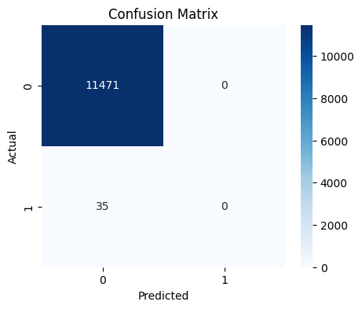

# Credit Card Fraud Detection 💳

## 📌 Overview
This project focuses on detecting fraudulent credit card transactions using both anomaly detection techniques and supervised machine learning models. The goal is to identify suspicious transactions efficiently and improve financial security.

---

## 🎯 Objective
To build a system that can accurately classify transactions as fraudulent or legitimate using machine learning algorithms and provide predictions through a simple user interface.

---

## 🛠️ Tools & Technologies
- Python  
- Pandas, NumPy  
- Scikit-learn  
- XGBoost  
- Matplotlib, Seaborn  
- Streamlit  

---

## 📊 Dataset
The dataset used in this project is publicly available on Kaggle:

🔗 https://www.kaggle.com/datasets/mlg-ulb/creditcardfraud  

> Note: Due to large file size, the dataset is not included in this repository. Download it and place `creditcard.csv` in the project folder before running the notebook.

---

## ⚙️ Methodology

### 1. Data Preprocessing
- Loaded dataset using Pandas  
- Checked for missing values  
- Converted target variable to proper format  
- Split dataset into training and testing sets  

### 2. Anomaly Detection
- Applied **Isolation Forest**  
- Applied **Local Outlier Factor (LOF)**  
- Compared detection performance  

### 3. Supervised Learning
- Trained **XGBoost Classifier**  
- Handled imbalanced dataset  
- Generated predictions  

### 4. Model Evaluation
- Accuracy Score  
- Confusion Matrix  
- Classification Report  
- ROC Curve  

### 5. Deployment
- Built a simple UI using **Streamlit**  
- Integrated trained model for prediction  

---

## 🤖 Model Used

- Isolation Forest (Anomaly Detection)
- Local Outlier Factor (Outlier Detection)
- XGBoost Classifier (Supervised Learning)

XGBoost provided the best performance among all models.

---

## 📈 Results

The model achieved strong performance in detecting fraudulent transactions.

### 🔹 Confusion Matrix

### 🔹 Key Metrics
- High accuracy in classification  
- Effective fraud detection using anomaly + supervised models  
- ROC curve indicates strong model performance  

---

## 🧪 How to Run

1. Clone the repository  
2. Download dataset from Kaggle  
3. Place `creditcard.csv` in the project folder  
4. Run notebook:
5. Run UI:

---

## 📁 Project Structure

- fraud_detection.ipynb – Notebook with full implementation  
- fraud_model.pkl – Saved trained model  
- app.py – Streamlit UI  
- ui_output.png – Screenshot of output  
- README.md – Documentation  

---

## 🚀 Conclusion
This project demonstrates how combining anomaly detection techniques with machine learning models can effectively identify fraudulent transactions. It highlights the importance of data preprocessing, model evaluation, and real-time prediction systems in financial applications.

---

## 🔮 Future Improvements
- Improve feature engineering  
- Use deep learning models  
- Deploy full-scale web application  
- Enhance real-time fraud detection system  

---
