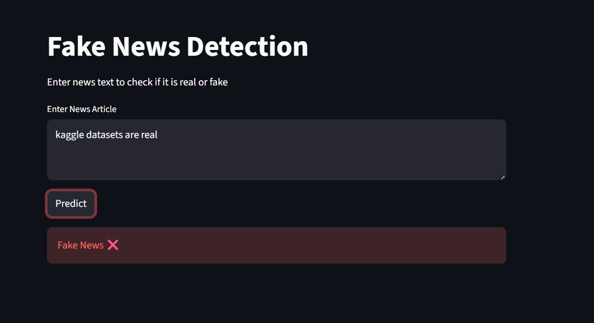

# Fake News Detection 📰

## 📌 Overview
This project classifies news articles as fake or real using Natural Language Processing and Machine Learning.

---

## 🎯 Objective
To build a model that can accurately detect fake news based on textual content.

---

## 🛠️ Tools & Technologies
- Python  
- Pandas  
- Scikit-learn  
- TF-IDF Vectorization  
- Streamlit  

---

## 📊 Dataset
Dataset used:
https://www.kaggle.com/datasets/clmentbisaillon/fake-and-real-news-dataset  

---

## ⚙️ Methodology
- Data preprocessing and labeling  
- Text vectorization using TF-IDF  
- Logistic Regression model training  
- Model evaluation using accuracy and confusion matrix  
- Deployment using Streamlit  

---

## 📈 Results

### Confusion Matrix

---
## 📊 Observations

- The model performs well in detecting fake news articles based on textual patterns.
- Some inputs may be classified as fake due to differences between training data and user input.
- The model is sensitive to vocabulary and writing style used in news content.

---

## ⚠️ Limitations

- The model may not generalize well to completely unseen news formats.
- Performance depends on the quality and balance of the dataset.
- Requires further tuning and larger datasets for better accuracy.

---

## 🔮 Future Improvements

- Improve dataset balancing
- Use advanced NLP models like BERT
- Enhance preprocessing techniques
- Deploy with real-time API integration
  
## 🧪 How to Run

- Clone the Repository: git clone https://github.com/rohanronniie/Applied-AI-ML-Projects.git
- Navigate to Project Folder: cd Fake-News-Detection
- Install Required Libraries: pip install pandas numpy scikit-learn streamlit joblib
- Run Jupyter Notebook: jupyter notebook fake_news.ipynb
- Run Streamlit App: python -m streamlit run app.py
- Use the Application
- Enter news text in the input box  
- Click **Predict**  
- View result (Fake or Real)

## 📁 Project Structure

- fake_news.ipynb  
- fake_news_model.pkl  
- tfidf_vectorizer.pkl  
- app.py  
- ui_output.png  
- README.md  

---

## 🚀 Conclusion
The model successfully distinguishes between fake and real news articles using NLP techniques and machine learning.
